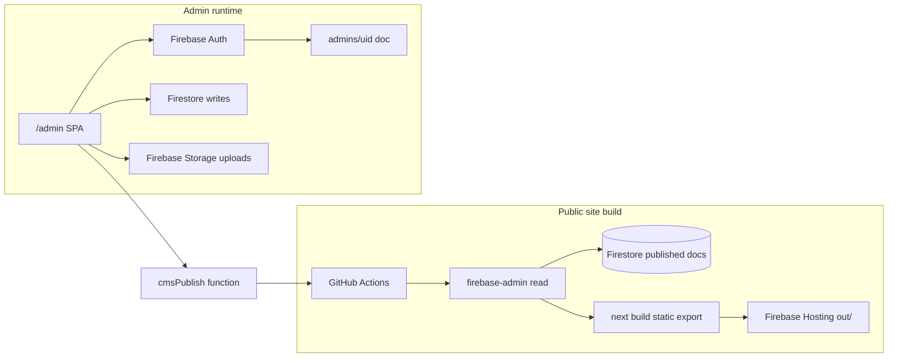

# Firebase CMS Migration, Admin Panel, and Auth

## Goals and constraints

- **Full migration**: All 14 Sanity document types move to Firestore; Sanity Studio and dependencies are removed when cutover is complete.
- **Auth**: Firebase Auth with **email + password** for admin users only (no public sign-up).
- **Hosting model unchanged**: Public site stays **`output: 'export'`** ([`next.config.ts`](next.config.ts)) → static `out/` on Firebase Hosting.
- **Admin works with static export**: `/admin/**` is a **client-only** React app (Firebase Auth + Firestore + Storage SDK). No SSR required.



---

## Current state (what we replace)

| Layer        | Today                            | Files                                                                                                    |
| ------------ | -------------------------------- | -------------------------------------------------------------------------------------------------------- |
| CMS fetch    | Sanity GROQ at build time        | [`lib/sanity/fetch.ts`](lib/sanity/fetch.ts), 14 schemas in [`sanity/schemaTypes/`](sanity/schemaTypes/) |
| Images       | Sanity CDN via `urlFor()`        | [`components/shared/SanityImage.tsx`](components/shared/SanityImage.tsx)                                 |
| Rich text    | Portable Text                    | [`components/shared/PortableTextContent.tsx`](components/shared/PortableTextContent.tsx)                 |
| Forms/leads  | Cloud Functions → `leads`        | [`functions/src/lib/firestore.ts`](functions/src/lib/firestore.ts)                                       |
| Rebuild hook | Sanity webhook → GitHub dispatch | [`functions/src/sanityRevalidate.ts`](functions/src/sanityRevalidate.ts)                                 |
| Security     | Leads fully locked               | [`firestore.rules`](firestore.rules)                                                                     |

Public pages import `@/lib/sanity/fetch` from 14 files (layout + 9 routes + sitemap).

---

## Target Firestore schema

Use **fixed singleton doc IDs** for page-level settings and **typed collections** for lists. Every document includes:

- `status`: `"draft"` | `"published"`
- `updatedAt`, `publishedAt` (timestamps)
- `legacySanityId` (optional, for migration traceability)

### Singletons (`cms/singletons/{docId}`)

| docId             | Replaces Sanity type |
| ----------------- | -------------------- |
| `siteSettings`    | siteSettings         |
| `navigation`      | navigation           |
| `homePage`        | homePage             |
| `aboutPage`       | aboutPage            |
| `appointmentPage` | appointmentPage      |
| `leadMagnet`      | leadMagnet           |

### Collections

| Collection             | Replaces                    | Key indexes                          |
| ---------------------- | --------------------------- | ------------------------------------ |
| `cms/pages`            | page (privacy-policy, etc.) | `slug` + `status`                    |
| `cms/blogPosts`        | blogPost                    | `status`, `publishedAt` desc, `slug` |
| `cms/testimonials`     | testimonial                 | `status`, `publishedAt` desc         |
| `cms/locations`        | location                    | `status`, `order`                    |
| `cms/faqItems`         | faqItem                     | `status`, `order`                    |
| `cms/teamMembers`      | teamMember                  | `status`, `order`                    |
| `cms/trustBadges`      | trustBadge                  | `status`, `order`                    |
| `cms/caseStudies`      | caseStudy                   | `status`, `order`                    |
| `cms/socialProofItems` | socialProofItem             | `status`, `order`                    |
| `leads`                | (unchanged)                 | `createdAt` desc, `type`             |
| `admins`               | (new)                       | doc ID = Auth `uid`                  |

### Field type changes

- **`SanityImage` → `CmsImage`**: `{ storagePath, url, alt, width?, height? }` — URL denormalized on upload for fast build reads.
- **Rich text (`story`, `body`, `directions`, FAQ answers)**: Store as **Markdown strings** in Firestore. Replace `PortableTextContent` with a `MarkdownContent` component (`react-markdown` + existing Tailwind prose classes). One-time migration script converts Sanity Portable Text → Markdown (or HTML→MD via `@portabletext/to-markdown`).

Domain types live in [`types/index.ts`](types/index.ts); rename `_id` → `id` for Firestore docs.

---

## Security: Auth + rules + Storage

### 1. Enable Firebase Auth (email/password)

Add to [`firebase.json`](firebase.json):

```json
"auth": { "providers": { "emailPassword": true } }
```

Deploy: `firebase deploy --only auth,firestore:rules,storage`.

**Bootstrap first admin** (one-time, not self-service sign-up):

1. Create user in Firebase Console (Auth → Add user).
2. Run seed script `scripts/seed-admin.mjs` writing `admins/{uid}` with `{ email, role: "admin", createdAt }`.
3. Disable public registration in Console (only admins created manually or via seed).

### 2. Firestore rules ([`firestore.rules`](firestore.rules))

```javascript
function isAdmin() {
  return request.auth != null
    && exists(/databases/$(database)/documents/admins/$(request.auth.uid));
}

// cms/* : public read only published; admin read/write all
// leads/* : admin read only; create/update/delete still via Functions only
// admins/* : admin read; no client writes (seed via Admin SDK script)
```

### 3. Storage rules (new `storage.rules`)

- Path: `cms/{collection}/{docId}/{filename}`
- **Read**: public (images on marketing site)
- **Write**: `isAdmin()` only
- Register in [`firebase.json`](firebase.json)

---

## Data layer: replace `lib/sanity/*`

Create [`lib/cms/`](lib/cms/) mirroring the **same exported function names** as [`lib/sanity/fetch.ts`](lib/sanity/fetch.ts) so page imports change minimally:

| File                        | Role                                                                 |
| --------------------------- | -------------------------------------------------------------------- |
| `lib/cms/admin.ts`          | Firebase Admin init (build + scripts); reads **published** docs only |
| `lib/cms/fetch.ts`          | Drop-in replacement for `getSiteSettings()`, `getBlogPosts()`, etc.  |
| `lib/cms/defaults.ts`       | Move defaults from [`lib/sanity/queries.ts`](lib/sanity/queries.ts)  |
| `lib/firebase/auth.ts`      | Client Auth helpers (`signIn`, `signOut`, `onAuthStateChanged`)      |
| `lib/firebase/firestore.ts` | Typed admin CRUD helpers (client SDK)                                |
| `lib/firebase/storage.ts`   | Image upload + URL resolution                                        |

**Build-time credentials**: CI already has `FIREBASE_SERVICE_ACCOUNT` ([`.github/workflows/firebase-hosting-merge.yml`](.github/workflows/firebase-hosting-merge.yml)). Pass JSON to `GOOGLE_APPLICATION_CREDENTIALS` (temp file) before `npm run build`.

**Local dev**: Use Firebase emulators OR service account in `.env.local` (document in setup guide; never commit).

### Component updates

- [`components/shared/SanityImage.tsx`](components/shared/SanityImage.tsx) → `CmsImage.tsx` (same props shape, different URL source)
- [`lib/seo.ts`](lib/seo.ts): swap `sanityImageUrl` → `cmsImageUrl`
- All `@/lib/sanity/fetch` imports → `@/lib/cms/fetch`

Keep [`lib/sanity/*`](lib/sanity/) until migration script validates parity, then delete.

---

## Admin panel (`app/admin/`)

All routes use `"use client"` and are compatible with static export.

### Route map

| Route                          | Purpose                                                              |
| ------------------------------ | -------------------------------------------------------------------- |
| `/admin/login`                 | Email/password form → Firebase Auth                                  |
| `/admin`                       | Dashboard: content shortcuts, lead count, last publish               |
| `/admin/leads`                 | Filterable inbox (contact, appointment, beat_offer, value_estimator) |
| `/admin/content/site-settings` | Singleton editor                                                     |
| `/admin/content/navigation`    | Nav items CRUD                                                       |
| `/admin/content/home`          | Home page fields                                                     |
| `/admin/content/about`         | About + team + trust badges tabs                                     |
| `/admin/content/appointment`   | Appointment page + checklist arrays                                  |
| `/admin/content/blog`          | List + edit blog posts (markdown body)                               |
| `/admin/content/testimonials`  | List + edit                                                          |
| `/admin/content/locations`     | List + edit + map fields                                             |
| `/admin/content/faq`           | Ordered FAQ list                                                     |
| `/admin/content/pages`         | Generic pages (privacy-policy slug)                                  |
| `/admin/content/marketing`     | Case studies, social proof, lead magnet                              |

### Shared admin UI

Reuse existing shadcn components under [`components/ui/`](components/ui/):

- `AdminLayout` — sidebar nav + auth gate (redirect to `/admin/login`)
- `AuthProvider` — wraps admin layout, listens to auth state
- `ImageUploadField` — Storage upload → sets `CmsImage` on doc
- `MarkdownField` — textarea with preview
- `SaveBar` — Save draft / Publish / **Publish site** (trigger rebuild)

### Auth gate pattern

```tsx
// app/admin/layout.tsx — client component
// if !user → redirect /admin/login
// if user && !admins/{uid} exists → show "Unauthorized" (signed in but not admin)
```

---

## Publish / rebuild flow

Replace [`functions/src/sanityRevalidate.ts`](functions/src/sanityRevalidate.ts) with `cmsPublish`:

- **POST** `/api/cms-publish` (Firebase Hosting rewrite)
- Verify `Authorization: Bearer <Firebase ID token>` and caller is admin (verify token + check `admins` doc via Admin SDK)
- Trigger GitHub `repository_dispatch` with event `cms-publish` (rename workflow trigger from `sanity-publish`)

Update [`.github/workflows/firebase-hosting-merge.yml`](.github/workflows/firebase-hosting-merge.yml):

- Remove Sanity env vars and verify step
- Add `GOOGLE_APPLICATION_CREDENTIALS` setup from `FIREBASE_SERVICE_ACCOUNT`
- Change `repository_dispatch` type to `cms-publish`

Admin **Publish site** button: get ID token → POST to `/api/cms-publish`.

---

## Content migration (Sanity → Firestore)

One-time script: [`scripts/migrate-sanity-to-firestore.mjs`](scripts/migrate-sanity-to-firestore.mjs)

1. Read all documents via Sanity API (reuse env: `NEXT_PUBLIC_SANITY_*`, `SANITY_API_READ_TOKEN`)
2. Download image assets → upload to Firebase Storage → set `CmsImage` fields
3. Convert Portable Text → Markdown for rich fields
4. Write Firestore docs with `status: "published"` and `legacySanityId`
5. Emit validation report (counts per type vs Sanity)

**Cutover checklist**:

1. Run migration script against production Firestore
2. Swap fetch layer imports to `@/lib/cms/fetch`
3. `npm run build` locally with service account — verify all 9 routes + blog slugs
4. Deploy rules, auth, functions, hosting
5. Client UAT on `/admin`
6. Remove Sanity: delete `sanity/`, `app/studio/`, `sanity.config.ts`, `lib/sanity/`, deps (`sanity`, `next-sanity`, `@sanity/*`), update docs

---

## Implementation phases (ordered)

### Phase 1 — Foundation (≈1 week)

- Firestore schema types in [`types/cms.ts`](types/cms.ts) (or extend [`types/index.ts`](types/index.ts))
- [`firestore.rules`](firestore.rules), [`storage.rules`](storage.rules), [`firestore.indexes.json`](firestore.indexes.json)
- Enable Auth in [`firebase.json`](firebase.json); seed script for first admin
- Extend [`lib/firebase.ts`](lib/firebase.ts) with Auth/Firestore/Storage client exports
- `lib/cms/admin.ts` + `lib/cms/fetch.ts` with defaults (published-only reads)

### Phase 2 — Public site swap (≈1 week)

- `CmsImage`, `MarkdownContent`
- Replace all `@/lib/sanity/fetch` imports (14 call sites)
- CI build wired to Firebase Admin credentials
- Remove Portable Text dependency if no longer needed

### Phase 3 — Admin shell + leads inbox (≈1–2 weeks)

- `app/admin/login`, layout, auth provider, dashboard
- `/admin/leads` with Firestore queries (type filter, date sort, detail view)
- Basic singleton editors: site settings, navigation

### Phase 4 — Full content CRUD (≈2–3 weeks)

- Admin forms for all remaining types (blog, testimonials, locations, FAQ, pages, marketing)
- Image upload, markdown editor, draft/publish toggles
- `cmsPublish` function + admin Publish site button

### Phase 5 — Migration + cleanup (≈1 week)

- Migration script + validation
- Run migration, cutover, remove Sanity
- Update [`docs/setup-local.md`](docs/setup-local.md), [`docs/content-entry-checklist.md`](docs/content-entry-checklist.md) for Firestore admin workflow
- Update CONTEXT.md in touched folders

---

## Files to add (summary)

| Path                                                                | Purpose                     |
| ------------------------------------------------------------------- | --------------------------- |
| `lib/cms/admin.ts`, `fetch.ts`, `defaults.ts`                       | Build-time CMS              |
| `lib/firebase/auth.ts`, `firestore.ts`, `storage.ts`                | Client admin IO             |
| `app/admin/**`                                                      | Admin UI routes             |
| `components/admin/**`                                               | Admin-specific forms/layout |
| `components/shared/CmsImage.tsx`, `MarkdownContent.tsx`             | Public rendering            |
| `functions/src/cmsPublish.ts`                                       | Rebuild webhook             |
| `scripts/migrate-sanity-to-firestore.mjs`, `scripts/seed-admin.mjs` | Ops scripts                 |
| `storage.rules`                                                     | Media security              |

## Files to remove (after cutover)

- `sanity/`, `sanity.config.ts`, `app/studio/`
- `lib/sanity/`
- `functions/src/sanityRevalidate.ts`
- Sanity npm dependencies

---

## Risks and mitigations

| Risk                                        | Mitigation                                                                                                    |
| ------------------------------------------- | ------------------------------------------------------------------------------------------------------------- |
| Rich text fidelity in migration             | Spot-check blog/about/privacy after PT→MD conversion; keep raw PT in `legacyBody` field temporarily if needed |
| Admin exposed on public Hosting             | Firestore/Storage rules enforce admin; no public sign-up; optional `robots.txt` disallow `/admin`             |
| Static export cannot protect server secrets | Admin uses client SDK only; privileged ops (rebuild) go through Cloud Function with ID token verification     |
| Large admin scope                           | Shared form primitives (singleton editor, collection list+edit) reduce duplication across 14 types            |

---

## Test plan

- **Rules unit tests**: Firebase emulator tests for admin vs anonymous read/write on `cms/*` and `leads/*`
- **Build parity**: Compare rendered HTML for key routes before/after migration (Playwright snapshot or manual)
- **Admin E2E**: Login → edit site settings → publish → trigger rebuild → verify live site
- **Migration validation**: Script asserts document counts match Sanity export

---

## Estimated effort

**6–8 weeks** for one developer at full Sanity parity (all content types + leads inbox + migration + docs). Critical path is Phase 4 (CRUD for 14 types with image upload and markdown editing).
