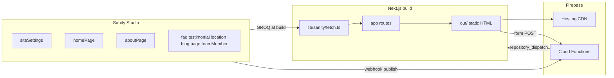
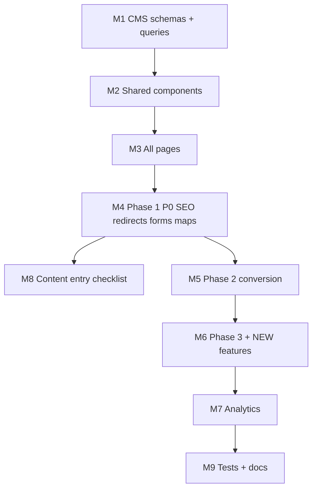

# Site Outline & Features — Full Implementation Plan

## Current baseline

**Already in place:** Next.js 16 static export, 9 routes, Firebase Hosting + Gen 2 Functions (contact, appointment, revalidate), basic Sanity schemas, partial CMS wiring (layout settings/nav, FAQ, testimonials, locations, blog), forms + reCAPTCHA, CI deploy, embedded Studio.

**Major gaps:** Most page sections are hardcoded placeholders; CMS lacks homepage/about singletons, image fields, team members, extended location/blog/testimonial fields; `page` schema is unused; no maps, JSON-LD beyond LocalBusiness, no 301 redirects, incomplete appointment form, no Phase 2/3 or NEW features.

---

## Architecture decisions (locked for this plan)

| Decision                    | Choice                                                                          | Rationale                                                                    |
| --------------------------- | ------------------------------------------------------------------------------- | ---------------------------------------------------------------------------- |
| Content model               | Typed singletons + document collections                                         | Matches spec’s CMS-driven sections without building a page builder           |
| Images                      | Sanity `image` fields + [`lib/sanity/image.ts`](lib/sanity/image.ts) `urlFor()` | Built-in asset library; static export uses Sanity CDN (`unoptimized` images) |
| Singletons                  | Custom Studio structure in [`sanity.config.ts`](sanity.config.ts)               | Prevent duplicate Site Settings / Navigation / Home                          |
| Blog pagination             | `/blog?page=2` query param on static export                                     | Matches redirect map; client-side or pre-rendered page slices at build       |
| A/B testing (Phase 2)       | Defer or use GA4 experiments / Firebase Remote Config                           | Spec mentions Vercel Edge Config; project hosts on Firebase                  |
| Content migration           | **Manual in Studio** (per your choice)                                          | Deliver schemas + editorial checklist, not import scripts                    |
| San Diego/Murrieta location | Optional location doc, flagged in Studio                                        | Spec says confirm with client—schema supports it without requiring it        |

---

## Milestone 1 — CMS foundation (schemas, Studio, types, queries)

### 1.1 Split and extend schemas in [`sanity/schemaTypes/`](sanity/schemaTypes/)

Refactor monolithic [`sanity/schemaTypes/index.ts`](sanity/schemaTypes/index.ts) into focused files:

| Schema            | Type                | Key fields (additions vs today)                                                                                                                                                           |
| ----------------- | ------------------- | ----------------------------------------------------------------------------------------------------------------------------------------------------------------------------------------- |
| `siteSettings`    | singleton           | `logo`, `tagline`, `defaultOgImage`, `yelpUrl`, `yelpRating`, `googleUrl`, `facebookUrl`, existing contact + bars                                                                         |
| `navigation`      | singleton           | `items[]` (unchanged)                                                                                                                                                                     |
| `homePage`        | singleton           | hero (headline, subheadline, `heroImage`, primary/secondary CTA labels+links), `whySellHeadline`, `whySellBullets[]`, `compareHeadline`, `compareBullets[]`, optional `videoUrl` (NEW #4) |
| `aboutPage`       | singleton           | `story` (blocks), `confidenceGuarantee` (blocks), hero title                                                                                                                              |
| `teamMember`      | collection          | `name`, `role`, `bio`, `photo`, `order`                                                                                                                                                   |
| `appointmentPage` | singleton           | `hero` copy, `whyUsCards[]` (title + description)                                                                                                                                         |
| `faqItem`         | collection          | add `anchorId` (e.g. `compare-offers`) for deep links                                                                                                                                     |
| `testimonial`     | collection          | add `rating`, `publishedAt`                                                                                                                                                               |
| `location`        | collection          | `phones[]`, `photo`, `mapEmbedUrl` or lat/lng, `directions` (blocks), `locationType`, `note`, `isFieldAppraisalOnly`                                                                      |
| `blogPost`        | collection          | `mainImage`, `category`, `author`, `relatedPosts[]` refs                                                                                                                                  |
| `page`            | collection          | wire to `/privacy-policy` and future generic pages                                                                                                                                        |
| `trustBadge`      | collection (NEW #8) | label, icon/image, optional link                                                                                                                                                          |
| `caseStudy`       | collection (NEW #5) | dealerOffer, ourOffer, customerName, carModel, `photo`, permission flag                                                                                                                   |
| `leadMagnet`      | singleton (NEW #11) | title, description, download `file` or external URL                                                                                                                                       |

Shared field helpers: `imageWithAlt`, `seoFields`, `portableTextBlock`.

### 1.2 Studio structure + asset library

- Add [`sanity/structure.ts`](sanity/structure.ts): group **Settings** (siteSettings, navigation), **Pages** (homePage, aboutPage, appointmentPage, leadMagnet), **Content** (FAQ, testimonials, locations, blog, team, case studies, trust badges, generic pages).
- Register in [`sanity.config.ts`](sanity.config.ts) via `structureTool({ structure })`.
- **Asset library:** any `type: "image"` or `type: "file"` field auto-populates Studio **Media**. Document in [`docs/setup-local.md`](docs/setup-local.md): upload via Media sidebar or document image fields; reuse across documents.

### 1.3 Data layer updates

- Extend [`types/index.ts`](types/index.ts) with new shapes + `SanityImage` type.
- Add GROQ in [`lib/sanity/queries.ts`](lib/sanity/queries.ts) and fetchers in [`lib/sanity/fetch.ts`](lib/sanity/fetch.ts) for each new schema.
- Add [`components/shared/SanityImage.tsx`](components/shared/SanityImage.tsx) wrapping `urlFor()` + `next/image` (unoptimized).

---

## Milestone 2 — Shared UI components & global shell

Build reusable sections in [`components/sections/`](components/sections/) aligned to spec:

| Component              | Used on                                                   |
| ---------------------- | --------------------------------------------------------- |
| `HeroSection` (extend) | Home, About, Schedule, Contact — support background image |
| `QuickActionsGrid`     | Home (static per spec)                                    |
| `BulletSection`        | Home why-sell + compare-offers                            |
| `StatsTrustBar`        | Home (static)                                             |
| `ProcessSteps`         | Home, About, Schedule                                     |
| `TestimonialsSlider`   | Home (client component, fetches 6 from CMS)               |
| `YelpBadge`            | Home, Testimonials, Schedule                              |
| `TrustBadgesRow`       | Home, About (NEW #8)                                      |
| `WhyUsGrid`            | Schedule (CMS-driven)                                     |
| `LocationsSidebar`     | Schedule                                                  |
| `GoogleMapEmbed`       | Contact, Locations                                        |
| `PortableTextContent`  | Already exists — reuse                                    |
| `SocialProofTicker`    | Home optional strip (NEW #12)                             |
| `DocumentChecklist`    | Schedule / FAQ (NEW #6)                                   |

Update global shell:

- [`components/shared/Nav.tsx`](components/shared/Nav.tsx): logo from CMS, phone click-to-call, CTA button “Get a Free Appraisal”.
- [`components/shared/Footer.tsx`](components/shared/Footer.tsx): logo, tagline, social icons from `siteSettings`.
- [`components/shared/CTABanner.tsx`](components/shared/CTABanner.tsx): optional sticky-on-scroll behavior (spec optional).

---

## Milestone 3 — Page-by-page implementation

Wire each route in [`app/(site)/`](<app/(site)/>) to CMS + sections from spec:

### Homepage [`app/(site)/page.tsx`](<app/(site)/page.tsx>)

All 11 sections from spec table (rows 1–10 + footer via layout). CMS: hero, why-sell, compare, testimonial slider; static: quick actions, stats, process, Yelp; layout handles announcement + CTA + footer.

### About [`app/(site)/about-us/page.tsx`](<app/(site)/about-us/page.tsx>)

Fetch `aboutPage` + `teamMember[]`. Sections: hero (static title OK), story, 3-step process (static), confidence guarantee, team grid, CTA.

### FAQ [`app/(site)/faq/page.tsx`](<app/(site)/faq/page.tsx>)

Keep accordion; add FAQPage JSON-LD; support `anchorId` for `#compare-offers`; seed editorial checklist with 12 spec questions.

### Schedule [`app/(site)/schedule-appointment/page.tsx`](<app/(site)/schedule-appointment/page.tsx>)

Hero, process, enhanced form, why-us grid (CMS), Yelp, locations sidebar, document checklist widget.

### Testimonials [`app/(site)/testimonials/page.tsx`](<app/(site)/testimonials/page.tsx>)

Yelp badge, grid with rating/date, Review JSON-LD aggregate + individual items.

### Locations [`app/(site)/branch-locations/page.tsx`](<app/(site)/branch-locations/page.tsx>)

Per-location: address, phones, hours, photo, map embed, directions, field-appraisal note, schedule CTA. LocalBusiness JSON-LD per location.

### Blog [`app/(site)/blog/page.tsx`](<app/(site)/blog/page.tsx>) + [`[slug]/page.tsx`](<app/(site)/blog/[slug]/page.tsx>)

Card grid with featured image, excerpt, date, category; pagination via `?page=`; post page with image, author, related posts, sell CTA; BlogPosting JSON-LD.

### Contact [`app/(site)/contact/page.tsx`](<app/(site)/contact/page.tsx>)

Hero, form, contact info from `siteSettings`, Irvine map, quick links.

### Privacy [`app/(site)/privacy-policy/page.tsx`](<app/(site)/privacy-policy/page.tsx>)

Fetch `page` where `slug == "privacy-policy"`; fallback placeholder until content entered.

---

## Milestone 4 — Phase 1 P0 launch hardening

| Item             | Implementation                                                                                                                                                                                                                                                                                      |
| ---------------- | --------------------------------------------------------------------------------------------------------------------------------------------------------------------------------------------------------------------------------------------------------------------------------------------------- |
| Static SSG       | Already `output: 'export'`; ensure all CMS pages use build-time fetch                                                                                                                                                                                                                               |
| Responsive       | Tailwind mobile-first pass on new sections                                                                                                                                                                                                                                                          |
| Contact form     | [`components/forms/ContactForm.tsx`](components/forms/ContactForm.tsx) — verify phone field optional per spec                                                                                                                                                                                       |
| Appointment form | Extend [`lib/validators/forms.ts`](lib/validators/forms.ts) + [`AppointmentForm.tsx`](components/forms/AppointmentForm.tsx): `vehicleMileage`, `conditionDescription`, `hasPreviousOffer` checkbox; update [`functions/src/appointmentForm.ts`](functions/src/appointmentForm.ts) + Resend template |
| Google Maps      | `GoogleMapEmbed` with embed URL from location or siteSettings                                                                                                                                                                                                                                       |
| Schema.org       | Extend [`lib/seo.ts`](lib/seo.ts): `buildFaqPageJsonLd`, `buildReviewJsonLd`, `buildBlogPostingJsonLd`, multi-location LocalBusiness; inject per page                                                                                                                                               |
| 301 redirects    | Add `hosting.redirects` in [`firebase.json`](firebase.json) for WordPress URLs from spec redirect table + `/contact-2/`                                                                                                                                                                             |
| Meta + OG        | Default OG from `siteSettings.defaultOgImage`; per-page overrides from CMS SEO fields                                                                                                                                                                                                               |
| Sitemap          | [`app/sitemap.ts`](app/sitemap.ts) — already good; verify blog slugs                                                                                                                                                                                                                                |
| reCAPTCHA        | Already on forms — verify live domain in reCAPTCHA admin                                                                                                                                                                                                                                            |

---

## Milestone 5 — Phase 2 conversion optimization

| Feature                              | Approach                                                                                                                        |
| ------------------------------------ | ------------------------------------------------------------------------------------------------------------------------------- |
| Live chat (P1, NEW #3)               | Env-gated script in [`components/shared/LiveChat.tsx`](components/shared/LiveChat.tsx) via Partytown; Tidio/Intercom snippet    |
| Calendly (P1)                        | Optional embed URL in `appointmentPage` singleton; toggle vs form-only                                                          |
| SMS notifications (P1)               | Twilio in new Cloud Function triggered post-submit; secrets via Firebase Secret Manager                                         |
| Exit-intent popup (P1)               | Client component + `localStorage` dismiss; CMS copy in `siteSettings`                                                           |
| Vehicle photo upload (P1)            | Firebase Storage upload from form → signed URL or direct upload → attach URLs in Firestore + email; extend appointment function |
| Instant offer estimator (P2, NEW #1) | New route `/value-estimator/` + form → Cloud Function (rules-based range or external API stub) + lead capture                   |
| Retargeting pixels (P2)              | GTM/FB Pixel via existing [`components/shared/Analytics.tsx`](components/shared/Analytics.tsx)                                  |
| A/B testing (P1)                     | Document GA4 experiments; skip Vercel Edge Config                                                                               |

---

## Milestone 6 — Phase 3 content & growth + remaining NEW features

| Feature                             | Approach                                                                                               |
| ----------------------------------- | ------------------------------------------------------------------------------------------------------ |
| Blog content calendar (P2)          | Editorial process only; optional `publishedAt` scheduling note in Studio                               |
| Video testimonials (P2)             | `testimonial.videoUrl` field + embed component                                                         |
| FAQ expansion (P2)                  | Editorial — schema already supports unlimited `faqItem`                                                |
| Spanish i18n (P3)                   | Out of initial code scope unless requested: note as future `next-intl` or duplicate Sanity dataset     |
| Reviews aggregation (P3)            | Yelp/Google API deferred; static Yelp badge + manual testimonials for launch                           |
| **We Beat Your Offer** (NEW #2)     | New page `/beat-your-offer/` + form (text + optional photo upload) → Cloud Function + email            |
| **Video hero** (NEW #4)             | `homePage.videoUrl` field; hero component supports YouTube/Vimeo embed                                 |
| **Case studies** (NEW #5)           | `caseStudy` schema + section on About or Home                                                          |
| **Document checklist** (NEW #6)     | Interactive component on Schedule; CMS-driven items by ownership type                                  |
| **Service area map** (NEW #7)       | Static SVG/map image or embedded map on Locations; city landing pages deferred to Phase 3 SEO sprint   |
| **FAQ chat/search** (NEW #9)        | Client-side filter over fetched FAQ items on FAQ page                                                  |
| **Appointment reminders** (NEW #10) | Scheduled Cloud Function + Firestore appointment records (requires storing appointments with datetime) |
| **Lead magnet** (NEW #11)           | Download CTA on blog sidebar; email capture → Resend list or Firestore                                 |
| **Social proof ticker** (NEW #12)   | CMS-driven marquee on homepage                                                                         |

---

## Milestone 7 — Analytics events (from spec)

Extend [`components/shared/Analytics.tsx`](components/shared/Analytics.tsx) + small [`lib/analytics.ts`](lib/analytics.ts) helpers:

- `click_phone`, `click_address`, `form_start`, `form_submit`, `appointment_booked`, `cta_click`, scroll depth 50/90, `outbound_click` (Yelp/Google).

Wire to phone links, forms, CTAs across new sections.

---

## Milestone 8 — Manual content entry checklist (Studio)

Deliver [`docs/content-entry-checklist.md`](docs/content-entry-checklist.md) for editors:

1. **Site Settings** — contact info, logo, social URLs, announcement, CTA banner, default OG image
2. **Navigation** — 8 links per spec
3. **Home Page** — hero copy + hero image, why-sell bullets, compare bullets
4. **About Page** — story, confidence guarantee
5. **Team Members** — Adel Moini + staff (photos in Media)
6. **FAQ** — 12 questions from spec (include compare-offers anchor)
7. **Testimonials** — migrate ~28 from spec list
8. **Locations** — Irvine (full), West LA (field appraisal), optional San Diego/Murrieta
9. **Blog** — 10 legacy posts + featured images
10. **Privacy Policy** — page doc with slug `privacy-policy`
11. **Appointment Page** — why-us cards
12. **Trust badges, case studies, lead magnet** — as NEW features ship

After each publish batch: trigger rebuild via Sanity webhook → [`functions/src/sanityRevalidate.ts`](functions/src/sanityRevalidate.ts).

---

## Milestone 9 — Testing & documentation

- **Unit tests:** JSON-LD builders, form validators, GROQ result mappers in [`tests/`](tests/)
- **E2E:** Playwright smoke for all routes, form submit mocks, FAQ accordion, blog pagination
- **Update docs:** [`docs/site-outline-features.md`](docs/site-outline-features.md) status column; [`docs/setup-local.md`](docs/setup-local.md) CORS + content entry link
- **CONTEXT.md:** per project rules, update folders touched

---

## Suggested implementation order (dependency-aware)

**Recommended PR slices** (keeps CI green): (1) CMS foundation, (2) global shell + homepage, (3) remaining pages, (4) Phase 1 P0, (5) Phase 2 batch, (6) NEW features batch, (7) analytics + tests.

---

## Risk notes

- **Static export limits:** no server-side search/pagination without build-time param generation or client JS; blog pagination will use client slice or pre-built param pages.
- **Photo upload + Storage:** requires Firebase Storage rules and Blaze plan (already required for Functions).
- **SMS/reminders:** Twilio credentials + compliance (TCPA) — implement with feature flags.
- **Spanish i18n:** spec P3 — excluded from code unless scoped separately.
- **OG images:** require editors to upload `defaultOgImage` before social previews look correct.
