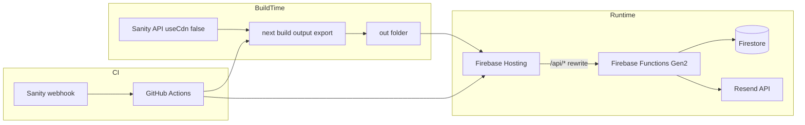

# Trade-In Solutions — Tech Stack Boilerplate Plan

## Current state

The repo is **greenfield**: only [docs/tech-stack.md](docs/tech-stack.md) and [docs/site-outline-features.md](docs/site-outline-features.md) exist. No `package.json`, app code, or Firebase config yet.

**Confirmed scope:** Sanity CMS + full Firebase Functions boilerplate (Blaze plan required for Resend/reCAPTCHA outbound calls).

---

## Architecture decision (resolve tech-stack conflicts)

The tech stack doc mixes two Firebase deployment models. For boilerplate, follow the **static export** model (Spark-friendly hosting + explicit Functions), not framework-aware SSR hosting.

| Topic                   | Tech-stack doc says                   | Official / correct approach                                                                                                                                                                                                             |
| ----------------------- | ------------------------------------- | --------------------------------------------------------------------------------------------------------------------------------------------------------------------------------------------------------------------------------------- |
| Next output             | `output: 'export'`                    | [Next.js static exports](https://nextjs.org/docs/app/guides/static-exports) → default folder `out/`                                                                                                                                     |
| `distDir`               | `'dist'` in sample                    | Omit unless required; default `out/` matches Firebase examples                                                                                                                                                                          |
| `firebase.json` hosting | `"source": "."` + `frameworksBackend` | Use `"public": "out"` for static export ([Firebase Hosting config](https://firebase.google.com/docs/hosting/full-config))                                                                                                               |
| Sanity preview / live   | preview mode, `defineLive`            | **Not compatible** with static export ([unsupported: Draft Mode](https://nextjs.org/docs/app/guides/static-exports#unsupported-features)); use build-time fetch + webhook-triggered CI rebuild                                          |
| Sitemap                 | `next-sitemap`                        | Prefer built-in `app/sitemap.ts` + `export const dynamic = 'force-static'` ([Next.js sitemap](https://nextjs.org/docs/app/api-reference/file-conventions/metadata/sitemap)); keep `next-sitemap` optional for advanced robots.txt needs |
| Partytown package       | `@builder.io/partytown`               | Use renamed **`@qwik.dev/partytown`** ([Partytown Next.js](https://partytown.qwik.dev/nextjs/)); App Router requires manual integration (no `strategy="worker"`)                                                                        |



---

## Target dependency versions (latest as of 2026-07-25)

Pin with `^` ranges at scaffold time; verify build after install.

| Package                                         | Latest      | Doc reference                                                                                   |
| ----------------------------------------------- | ----------- | ----------------------------------------------------------------------------------------------- |
| `next`                                          | **16.2.11** | [Next.js docs](https://nextjs.org/docs)                                                         |
| `react` / `react-dom`                           | **19.2.8**  | bundled with Next 16                                                                            |
| `typescript`                                    | **7.0.2**   | [TS handbook](https://www.typescriptlang.org/docs/) — fall back to 5.x if a dependency blocks 7 |
| `tailwindcss`                                   | **4.3.3**   | [Tailwind v4 upgrade](https://tailwindcss.com/docs/upgrade-guide)                               |
| `@tailwindcss/postcss`                          | latest      | [Tailwind + PostCSS](https://tailwindcss.com/docs/installation/framework-guides/nextjs)         |
| `sanity`                                        | **6.6.0**   | [Sanity + Next.js](https://www.sanity.io/docs/nextjs/introduction)                              |
| `next-sanity`                                   | **13.2.1**  | [Configure Sanity client](https://www.sanity.io/docs/nextjs/configure-sanity-client-nextjs)     |
| `@sanity/vision`                                | latest      | Sanity Studio                                                                                   |
| `@portabletext/react`                           | latest      | Portable Text rendering                                                                         |
| `framer-motion`                                 | **12.42.2** | [Motion docs](https://motion.dev/)                                                              |
| `lucide-react`                                  | **1.26.0**  | [Lucide](https://lucide.dev/guide/packages/lucide-react)                                        |
| `react-hook-form`                               | **7.83.0**  | [RHF](https://react-hook-form.com/get-started)                                                  |
| `@hookform/resolvers`                           | **5.4.3**   | Zod resolver                                                                                    |
| `zod`                                           | **4.4.3**   | [Zod v4](https://zod.dev/)                                                                      |
| `resend`                                        | **6.18.0**  | [Resend Node](https://resend.com/docs/send-with-nodejs)                                         |
| `firebase` (client SDK)                         | **12.16.0** | [Firebase web setup](https://firebase.google.com/docs/web/setup)                                |
| `firebase-admin` / `firebase-functions`         | latest      | [Functions Gen 2](https://firebase.google.com/docs/functions/http-events)                       |
| `@qwik.dev/partytown`                           | **0.14.0**  | [Partytown Next.js](https://partytown.qwik.dev/nextjs/)                                         |
| `next-themes`                                   | **0.4.6**   | [shadcn dark mode](https://ui.shadcn.com/docs/dark-mode/next)                                   |
| `tw-animate-css`                                | **1.4.0**   | [shadcn Tailwind v4](https://ui.shadcn.com/docs/tailwind-v4)                                    |
| `vitest`                                        | **4.1.10**  | [Next.js Vitest guide](https://nextjs.org/docs/app/guides/testing/vitest)                       |
| `@playwright/test`                              | **1.62.0**  | [Next.js Playwright guide](https://nextjs.org/docs/app/guides/testing/playwright)               |
| `eslint` / `prettier` / `husky` / `lint-staged` | latest      | standard tooling                                                                                |

---

## Phase 1 — Next.js foundation

**Docs:** [create-next-app](https://nextjs.org/docs/app/getting-started/installation), [static exports](https://nextjs.org/docs/app/guides/static-exports)

1. Scaffold at repo root (not nested subfolder):

```bash
    npx create-next-app@latest . --typescript --tailwind --eslint --app --no-src-dir --import-alias "@/*"


```

2. Configure [`next.config.ts`](next.config.ts):
   - `output: 'export'`
   - `images: { unoptimized: true }` (or custom Sanity loader later)
   - `trailingSlash: true` recommended for Firebase clean URLs
3. Add root files: [`.gitignore`](.gitignore), [`.env.example`](.env.example), [`README.md`](README.md) with setup steps.
4. Create folder skeleton from tech-stack §9:
   - [`app/(site)/`](<app/(site)/>) — route group + placeholder pages matching [site-outline-features.md](docs/site-outline-features.md) sitemap
   - [`components/{ui,sections,forms,shared}/`](components/)
   - [`lib/{sanity,utils,seo.ts,firebase.ts}/`](lib/)
   - [`types/index.ts`](types/index.ts)
   - [`public/`](public/)

**Placeholder routes to create (minimal `page.tsx` + metadata stub each):**
`/`, `/about-us`, `/faq`, `/schedule-appointment`, `/testimonials`, `/branch-locations`, `/blog`, `/blog/[slug]`, `/contact`, `/privacy-policy`

---

## Phase 2 — UI stack (Tailwind v4 + shadcn/ui)

**Docs:** [Tailwind v4 + Next.js](https://tailwindcss.com/docs/installation/framework-guides/nextjs), [shadcn Next.js](https://ui.shadcn.com/docs/installation/next), [shadcn Tailwind v4](https://ui.shadcn.com/docs/tailwind-v4)

1. Ensure Tailwind v4 CSS-first setup in [`app/globals.css`](app/globals.css):
   - `@import "tailwindcss"`
   - `@import "tw-animate-css"`
   - `@theme inline { ... }` with shadcn CSS variables (navy/gold tokens from site outline)
2. Ensure [`postcss.config.mjs`](postcss.config.mjs) uses `@tailwindcss/postcss`.
3. Run `npx shadcn@latest init` (React 19 / Tailwind v4 defaults).
4. Add baseline UI components used across site shell:
   `button`, `input`, `textarea`, `label`, `card`, `accordion`, `dialog`, `sheet`, `navigation-menu`, `separator`, `badge`
5. Fonts via [`next/font/google`](https://nextjs.org/docs/app/building-your-application/optimizing/fonts): Inter (body) in [`app/layout.tsx`](app/layout.tsx).
6. Install `framer-motion`, `lucide-react`, `next-themes`; add [`components/shared/ThemeProvider.tsx`](components/shared/ThemeProvider.tsx).
7. Create shell components (stubs): [`components/shared/Nav.tsx`](components/shared/Nav.tsx), [`Footer.tsx`](components/shared/Footer.tsx), [`AnnouncementBar.tsx`](components/shared/AnnouncementBar.tsx), [`CTABanner.tsx`](components/shared/CTABanner.tsx).

---

## Phase 3 — Sanity CMS boilerplate

**Docs:** [Sanity Next.js intro](https://www.sanity.io/docs/nextjs/introduction), [configure client](https://www.sanity.io/docs/nextjs/configure-sanity-client-nextjs), [query content](https://www.sanity.io/docs/nextjs/query-content-nextjs)

1. Run `npx sanity@latest init` in repo root:
   - Create/link Sanity project
   - Scaffold `sanity.config.ts`, `sanity.cli.ts`, schema folder, optional embedded Studio at `/studio`
2. Add [`lib/sanity/client.ts`](lib/sanity/client.ts):

```ts
createClient({
  projectId,
  dataset,
  apiVersion: "2026-07-25",
  useCdn: true,
});
```

3. Add [`lib/sanity/queries.ts`](lib/sanity/queries.ts) + [`lib/sanity/types.ts`](lib/sanity/types.ts) with GROQ stubs.
4. Implement schema files from tech-stack §11:
   `page`, `blogPost`, `testimonial`, `location`, `siteSettings`, `navigation`, `faqItem`
5. **Static export pattern** (critical):
   - Page data fetched at build time in Server Components via `client.withConfig({ useCdn: false }).fetch(...)`
   - [`app/(site)/blog/[slug]/page.tsx`](<app/(site)/blog/[slug]/page.tsx>): export `generateStaticParams()` + `dynamicParams = false`
   - Portable Text renderer via `@portabletext/react` in shared component
   - Sanity image helper via `@sanity/image-url` + `` or custom loader (no default `next/image` optimization)
6. **Skip for boilerplate:** `defineLive`, `SanityLive`, Draft Mode (incompatible with static export). Document webhook → CI rebuild instead.

**Env vars:** `NEXT_PUBLIC_SANITY_PROJECT_ID`, `NEXT_PUBLIC_SANITY_DATASET`, `SANITY_API_READ_TOKEN` (build/CI only)

---

## Phase 4 — SEO & metadata boilerplate

**Docs:** [Metadata API](https://nextjs.org/docs/app/building-your-application/optimizing/metadata), [robots](https://nextjs.org/docs/app/api-reference/file-conventions/metadata/robots), [sitemap](https://nextjs.org/docs/app/api-reference/file-conventions/metadata/sitemap)

1. [`lib/seo.ts`](lib/seo.ts) — helpers for title templates, canonical URLs, OG/Twitter defaults using `NEXT_PUBLIC_SITE_URL`.
2. [`app/(site)/layout.tsx`](<app/(site)/layout.tsx>) — site-wide `metadata` + JSON-LD stub component for `LocalBusiness`.
3. [`app/sitemap.ts`](app/sitemap.ts) — `export const dynamic = 'force-static'`; merge static routes + Sanity blog slugs at build time.
4. [`app/robots.ts`](app/robots.ts) — allow all + sitemap URL.
5. Per-page `generateMetadata` stubs on key routes (home, blog post).

---

## Phase 5 — Firebase project config

**Docs:** [Firebase init hosting](https://firebase.google.com/docs/hosting), [Functions HTTP](https://firebase.google.com/docs/functions/http-events), [Hosting rewrites to functions](https://firebase.google.com/docs/hosting/full-config#rewrites), [Firestore rules](https://firebase.google.com/docs/firestore/security/get-started), [Functions secrets](https://firebase.google.com/docs/functions/config-env)

1. Initialize Firebase in repo:

```bash
    npm i -g firebase-tools   # or npx firebase-tools@latest
    firebase login
    firebase init hosting,functions,firestore


```

    - Functions: TypeScript, Gen 2, Node 22, region `us-west1`
    - **Do not** enable framework-aware hosting (`experiments:enable webframeworks`) — avoids accidental SSR/Blaze SSR charges

2. Create/update config files:

    [`firebase.json`](firebase.json):

```json
{
  "hosting": {
    "public": "out",
    "ignore": ["firebase.json", "**/.*", "**/node_modules/**"],
    "cleanUrls": true,
    "rewrites": [
      {
        "source": "/api/contact",
        "function": {
          "functionId": "contactForm",
          "region": "us-west1"
        }
      },
      {
        "source": "/api/appointment",
        "function": {
          "functionId": "appointmentForm",
          "region": "us-west1"
        }
      },
      {
        "source": "/api/revalidate",
        "function": {
          "functionId": "sanityRevalidate",
          "region": "us-west1"
        }
      }
    ]
  },
  "functions": [{ "source": "functions", "codebase": "default" }],
  "firestore": {
    "rules": "firestore.rules",
    "indexes": "firestore.indexes.json"
  }
}
```

    [`firestore.rules`](firestore.rules) — use tech-stack §10 baseline (`leads` create-only from server perspective).

3. Client Firebase init in [`lib/firebase.ts`](lib/firebase.ts): - Guard with `typeof window !== 'undefined'` - Lazy-init Performance Monitoring via dynamic import ([Perf Mon web](https://firebase.google.com/docs/perf-mon/get-started-web)) - GA4 via env `NEXT_PUBLIC_GA_MEASUREMENT_ID` (wired in Phase 7)

---

## Phase 6 — Firebase Functions backend (full boilerplate)

**Docs:** [onRequest Gen 2](https://firebase.google.com/docs/functions/http-events), [Resend Node](https://resend.com/docs/send-with-nodejs), [reCAPTCHA v3 verify](https://developers.google.com/recaptcha/docs/v3), [defineSecret](https://firebase.google.com/docs/functions/config-env)

Structure in [`functions/src/`](functions/src/):

| File                  | Responsibility                                                                        |
| --------------------- | ------------------------------------------------------------------------------------- |
| `index.ts`            | Export all HTTP functions                                                             |
| `contactForm.ts`      | POST `/api/contact`                                                                   |
| `appointmentForm.ts`  | POST `/api/appointment`                                                               |
| `sanityRevalidate.ts` | POST `/api/revalidate` (verify webhook secret → trigger GitHub `repository_dispatch`) |
| `lib/validate.ts`     | Shared Zod schemas (mirror client)                                                    |
| `lib/recaptcha.ts`    | Verify token via Google siteverify                                                    |
| `lib/resend.ts`       | Resend client wrapper                                                                 |
| `lib/firestore.ts`    | Write to `leads` collection                                                           |

**Each form handler flow:**

1. CORS allow origin = production site URL (+ localhost in emulator)
2. Parse JSON body
3. Verify reCAPTCHA v3 token + action name
4. Validate with Zod
5. Write lead doc to Firestore
6. Send notification email via Resend
7. Return JSON `{ success: true }`

**Secrets (Firebase Secrets Manager):**
`RESEND_API_KEY`, `RECAPTCHA_SECRET_KEY`, `SANITY_WEBHOOK_SECRET`, `GITHUB_DISPATCH_TOKEN`

**Prerequisite:** Firebase project on **Blaze plan** (required for outbound Resend + reCAPTCHA calls).

---

## Phase 7 — Forms frontend boilerplate

**Docs:** [React Hook Form](https://react-hook-form.com/get-started), [Zod resolver](https://github.com/react-hook-form/resolvers#zod), [reCAPTCHA v3 client](https://developers.google.com/recaptcha/docs/v3)

1. [`components/forms/ContactForm.tsx`](components/forms/ContactForm.tsx) + [`AppointmentForm.tsx`](components/forms/AppointmentForm.tsx):
   - `'use client'`
   - RHF + `@hookform/resolvers/zod`
   - shadcn form fields
   - Execute reCAPTCHA v3 on submit; POST to `/api/contact` or `/api/appointment`
2. Shared Zod schemas in [`lib/validators/`](lib/validators/) (imported by client; duplicated typesafe subset in Functions).
3. Wire forms into `/contact` and `/schedule-appointment` placeholder pages.

---

## Phase 8 — Analytics & Partytown

**Docs:** [next/script](https://nextjs.org/docs/app/building-your-application/optimizing/scripts), [Partytown Next.js (App Router manual)](https://partytown.qwik.dev/nextjs/)

1. Install `@qwik.dev/partytown`; add npm script:
   `"partytown": "partytown copylib public/~partytown"`
   and prepend to build: `"build": "npm run partytown && next build"`
2. [`components/shared/Analytics.tsx`](components/shared/Analytics.tsx):
   - `<Partytown forward={['dataLayer.push']} />` in root layout
   - GTM / GA4 scripts with `type="text/partytown"` (env-gated; no-op without IDs)
3. Stub env vars: `NEXT_PUBLIC_GTM_ID`, `NEXT_PUBLIC_GA_MEASUREMENT_ID`, `NEXT_PUBLIC_RECAPTCHA_SITE_KEY`

---

## Phase 9 — Dev tooling

**Docs:** [Next.js ESLint](https://nextjs.org/docs/app/api-reference/config/eslint), [Vitest](https://nextjs.org/docs/app/guides/testing/vitest), [Playwright](https://nextjs.org/docs/app/guides/testing/playwright), [Husky](https://typicode.github.io/husky/)

1. **ESLint + Prettier:** extend Next defaults; add Prettier config + `eslint-config-prettier`.
2. **Husky + lint-staged:** pre-commit runs ESLint + Prettier on staged files.
3. **Vitest:** `vitest.config.mts`, `vitest.setup.ts` (mock `next/headers`, `next/navigation`), sample test for a client component / `cn()` util.
4. **Playwright:** `npm init playwright@latest`; configure `webServer` + `baseURL`; add smoke tests:
   - homepage loads
   - contact form renders (submit mocked/stubbed until secrets exist)

---

## Phase 10 — CI/CD (GitHub Actions)

**Docs:** [Firebase GitHub integration](https://firebase.google.com/docs/hosting/github-integration), [action-hosting-deploy](https://github.com/FirebaseExtended/action-hosting-deploy)

1. Run `firebase init hosting:github` (or hand-write workflows) to create:
   - [`.github/workflows/firebase-hosting-merge.yml`](.github/workflows/firebase-hosting-merge.yml) — deploy `out/` to live on merge to `main`
   - [`.github/workflows/firebase-hosting-pull-request.yml`](.github/workflows/firebase-hosting-pull-request.yml) — preview channels
2. Add build job steps:

```yaml
- uses: actions/setup-node@v4
  with: { node-version: "22" }
- run: npm ci
- run: npm run build
  env:
    NEXT_PUBLIC_SANITY_PROJECT_ID: ${{ secrets.NEXT_PUBLIC_SANITY_PROJECT_ID }}
    NEXT_PUBLIC_SANITY_DATASET: ${{ secrets.NEXT_PUBLIC_SANITY_DATASET }}
    SANITY_API_READ_TOKEN: ${{ secrets.SANITY_API_READ_TOKEN }}
    NEXT_PUBLIC_SITE_URL: https://tradeinsolutions-irvine.web.app
- uses: FirebaseExtended/action-hosting-deploy@v0
```

3. Separate workflow or job: `firebase deploy --only functions,firestore:rules` on merge (requires `FIREBASE_SERVICE_ACCOUNT`).
4. [`sanityRevalidate`](functions/src/sanityRevalidate.ts) calls GitHub `repository_dispatch` to re-run build workflow on Sanity publish.

**GitHub secrets checklist:**
`FIREBASE_SERVICE_ACCOUNT`, `NEXT_PUBLIC_SANITY_*`, `SANITY_API_READ_TOKEN`, `SANITY_WEBHOOK_SECRET`, build-time tokens as needed.

---

## Phase 11 — Documentation & env templates

1. [`.env.example`](.env.example) — all vars from tech-stack §6 step 6.
2. Update [docs/tech-stack.md](docs/tech-stack.md) with:
   - corrected `firebase.json` (static `out/` not framework backend)
   - latest dependency table
   - note that Draft Mode / SanityLive require SSR (future migration path)
3. Add [`docs/setup-local.md`](docs/setup-local.md) — step-by-step: Sanity project, Firebase Blaze, Resend domain verification, reCAPTCHA keys, first deploy.

---

## Verification checklist (definition of done)

- [ ] `npm run dev` serves all sitemap routes
- [ ] `npm run build` produces `out/` with no static-export errors
- [ ] `npm run test` (Vitest) passes
- [ ] `npx playwright test` smoke tests pass
- [ ] `firebase emulators:start` runs hosting + functions locally; form POST hits emulator function
- [ ] Sanity Studio loads at `/studio` (or standalone deploy documented)
- [ ] GitHub Action builds and deploys on push (after secrets configured)
- [ ] ESLint + Prettier + Husky pre-commit pass

---

## Implementation order (recommended)

Execute phases **1 → 2 → 3 → 4 → 7 → 5 → 6 → 8 → 9 → 10 → 11**. UI shell and Sanity queries come before Firebase wiring so the static build is testable early; Functions and CI come once pages compile cleanly.

---

## Risks & mitigations

| Risk                                       | Mitigation                                                                            |
| ------------------------------------------ | ------------------------------------------------------------------------------------- |
| TypeScript 7 peer-dep conflicts            | Pin TS 5.x temporarily if shadcn/Sanity block 7                                       |
| Zod v4 API differences vs doc samples (v3) | Use Zod 4 syntax in shared validators; reference [zod.dev migration](https://zod.dev) |
| Static export + dynamic blog routes        | Mandatory `generateStaticParams()` with `useCdn: false`                               |
| Blaze plan not enabled                     | Document blocker; Functions deploy will fail until billing enabled                    |
| Partytown beta / App Router manual setup   | Keep analytics env-gated; site works without Partytown                                |
